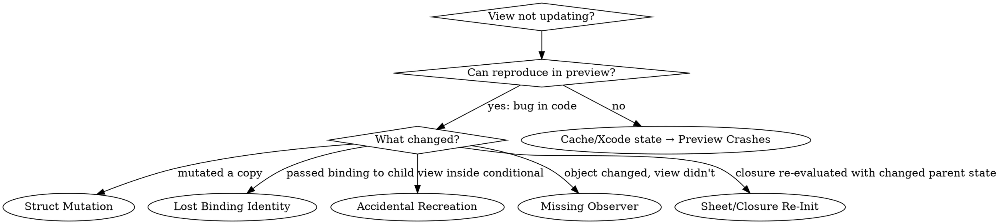
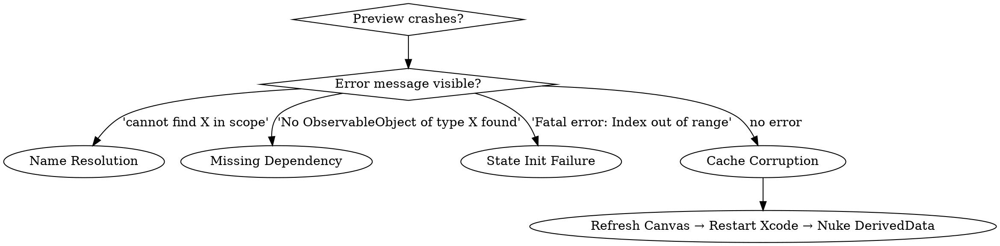

# SwiftUI Debugging

## Overview

SwiftUI debugging falls into three categories, each with a different diagnostic approach:

1. **View Not Updating** – You changed something but the view didn't redraw. Decision tree to identify whether it's struct mutation, lost binding identity, accidental view recreation, or missing observer pattern.
2. **Preview Crashes** – Your preview won't compile or crashes immediately. Decision tree to distinguish between names that don't resolve (a build error), missing dependencies, state initialization failures, and Xcode cache corruption.
3. **Layout Issues** – Views appearing in wrong positions, wrong sizes, overlapping unexpectedly. Quick reference patterns for common scenarios.

**Core principle**: Start with observable symptoms, test systematically, eliminate causes one by one. Don't guess.

**Requires**: Xcode 26+, iOS 18+
**Related skills**: `axiom-build (skills/xcode-debugging.md)` (cache corruption diagnosis), `axiom-concurrency` (observer patterns), `skills/swiftui-performance.md` (profiling with Instruments), `skills/layout.md` (adaptive layout patterns)

## Example Prompts

These are real questions developers ask that this skill is designed to answer:

#### 1. "My list item doesn't update when I tap the favorite button, even though the data changed"
→ The skill walks through the decision tree to identify struct mutation vs lost binding vs missing observer

#### 2. "Preview crashes with 'No ObservableObject of type AppModel found' but the app runs fine"
→ The skill shows how to provide missing dependencies with `.environment()` or `.environmentObject()`

#### 3. "My counter resets to 0 every time I toggle a boolean, why?"
→ The skill identifies accidental view recreation from conditionals and shows `.opacity()` fix

#### 4. "I'm using @Observable but the view still doesn't update when I change the property"
→ The skill explains when to use @State vs plain properties with @Observable objects

#### 5. "Text field loses focus when I start typing, very frustrating"
→ The skill identifies ForEach identity issues and shows how to use stable IDs

#### 6. "My sheet/modal always skips its loading animation and shows the completed state"
→ The skill identifies @ViewBuilder closure re-initialization from parent state changes causing init params to change

## When to Use SwiftUI Debugging

#### Use this skill when
- ✅ A view isn't updating when you expect it to
- ✅ Preview crashes or won't load
- ✅ Layout looks wrong on specific devices
- ✅ You're tempted to bandaid with @ObservedObject everywhere

#### Use `axiom-build (skills/xcode-debugging.md)` instead when
- App crashes at runtime (not preview)
- Build fails completely
- You need environment diagnostics

#### Use `axiom-concurrency` instead when
- Questions about async/await or MainActor
- Data race warnings

## Debugging Tools

### Self._printChanges()

SwiftUI provides an underscored method to understand why a view's body was called. It is public API, but the underscore warns that it can change or disappear — and it still prints in Release builds, so a leftover call is a shipping hazard rather than a debug-only convenience.

**Usage in LLDB**:
```swift
// Set breakpoint in view's body
// In LLDB console:
(lldb) expression Self._printChanges()
```

**Temporary in code** (remove before shipping):
```swift
var body: some View {
    let _ = Self._printChanges() // Debug only

    Text("Hello")
}
```

**Output interpretation** (measured on iOS 27.2):
```
MyView: @self, @identity, __count changed.
  - One line per body call, every cause of that call comma-joined on it, and a period at the end

@self
  - The view value itself changed (the parent passed a new instance)

@identity
  - The view's identity changed — its persistent state was recycled for a new instance of the same type
  - This is the marker for the state-reset symptom in Root Cause 3, not "@self"

_count  /  __count
  - A @State property changed. The name printed is the property's physical name, so an internal `@State var count` reports `_count` and `@State private var count` reports `__count`

_ext  /  _scheme  /  _model  /  _oo
  - A @Binding, @Environment, @EnvironmentObject or @StateObject property changed; each reports its own physical name

\Model.value
  - This body read an @Observable object's property that changed

MyView: (no output)
  - Body not being called; view not updating at all
```

**⚠️ Important**:
- Prefixed with underscore → May be removed in future releases
- Still prints in Release builds → delete the call before shipping
- Performance impact → Use only during debugging

**When to use**:
- Need to understand exact trigger for view update
- Investigating unexpected updates
- Verifying dependencies after refactoring

**Cross-reference**: For complex update patterns, use SwiftUI Instrument → see `skills/swiftui-performance.md` skill

---

## View Not Updating Decision Tree

The most common frustration: you changed @State but the view didn't redraw. The root cause is always one of four things.

### Step 1: Can You Reproduce in a Minimal Preview?

```swift
#Preview {
  YourView()
}
```

**YES** → The problem is in your code. Continue to Step 2.

**NO** → It's likely Xcode state or cache corruption. Skip to Preview Crashes section.

### Step 2: Diagnose the Root Cause

#### Root Cause 1: Struct Mutation Through Local Copy

**Symptom**: You modify a value, but the view doesn't update.

**Why it happens**: You captured the struct value in a local variable or passed it to a function that mutates a copy. The `@State` property wrapper only sees mutations through its own setter — changes to copies are invisible to SwiftUI.

```swift
// ❌ WRONG: Mutating a local copy — SwiftUI doesn't see it
@State var settings = AppSettings()

func resetTheme() {
    var copy = settings
    copy.theme = .default  // Mutates the copy, not the @State
    // View never updates
}

// ✅ RIGHT: Mutate through the @State property directly
func resetTheme() {
    settings.theme = .default  // @State sees this mutation
}

// ❌ ALSO WRONG: Nested struct mutation through a captured reference
func updateNestedValue(_ s: inout AppSettings) {
    s.theme = .dark
}
// Calling updateNestedValue(&localCopy) won't update the view
```

**Fix it**: Always mutate through the `@State` property itself, not through local copies or function parameters.

---

#### Root Cause 2: Lost Binding Identity

**Symptom**: You pass a binding to a child view, but changes in the child don't update the parent.

**Why it happens**: You're passing a read-only binding — `.constant()` discards every write, so the child's edits never reach the `@State` that owns the value. (A custom `Binding(get:set:)` built in `body` does reach its `@State`; it is not the cause.)

```swift
// ❌ WRONG: Constant binding is read-only
@State var isOn = false

ToggleChild(value: .constant(isOn))  // Changes ignored

// ✅ RIGHT: Pass the actual binding
@State var isOn = false

ToggleChild(value: $isOn)

// ✅ RIGHT (iOS 17+): Use @Bindable for @Observable objects
@Observable class Book {
    var title = "Sample"
    var isAvailable = true
}

struct EditView: View {
    @Bindable var book: Book  // Enables $book.title syntax

    var body: some View {
        TextField("Title", text: $book.title)
        Toggle("Available", isOn: $book.isAvailable)
    }
}

// ✅ ALSO RIGHT (iOS 17+): @Bindable as local variable
struct ListView: View {
    @State private var books = [Book(), Book()]

    var body: some View {
        List(books) { book in
            @Bindable var book = book  // Inline binding
            TextField("Title", text: $book.title)
        }
    }
}

```

**Fix it**: Pass the state down as a binding — `$state` for local state, `@Bindable` for an @Observable object (including `@Bindable var book = book` as a local inside a `ForEach` closure). Reserve `.constant()` for previews and for values the child must not edit.

---

#### Root Cause 3: Accidental View Recreation

**Symptom**: The view updates, but @State values reset to initial state. You see brief flashes of initial values.

**Why it happens**: The view got a new identity (removed from a conditional, moved in a container, or the container itself was recreated), causing SwiftUI to treat it as a new view.

```swift
// ❌ WRONG: View identity changes when condition flips
@State var count = 0

var body: some View {
    VStack {
        if showCounter {
            Counter()  // Gets new identity each time showCounter changes
        }
        Button("Toggle") {
            showCounter.toggle()
        }
    }
}

// Counter gets recreated, @State count resets to 0

// ✅ RIGHT: Preserve identity with opacity or hidden
@State var count = 0

var body: some View {
    VStack {
        Counter()
            .opacity(showCounter ? 1 : 0)
        Button("Toggle") {
            showCounter.toggle()
        }
    }
}
```

**Fix it**: Keep the view in the hierarchy — `.opacity()` or `.hidden()` — instead of removing and re-adding it with a conditional. `.id()` does not help here: it labels a view's identity while the view is present, and a view removed from the hierarchy loses its `@State` regardless of the id it carried.

---

#### Root Cause 4: Missing Observer Pattern

**Symptom**: An object changed, but views observing it didn't update.

**Why it happens**: SwiftUI doesn't know to watch for changes in the object.

```swift
// ❌ WRONG: Property changes don't trigger update
class Model {
    var count = 0  // Not observable
}

struct ContentView: View {
    let model = Model()  // New instance each render, not observable

    var body: some View {
        Text("\(model.count)")
        Button("Increment") {
            model.count += 1  // View doesn't update
        }
    }
}

// ✅ RIGHT (iOS 17+): Use @Observable with @State
@Observable class Model {
    var count = 0  // No @Published needed
}

struct ContentView: View {
    @State private var model = Model()  // @State, not @StateObject

    var body: some View {
        Text("\(model.count)")
        Button("Increment") {
            model.count += 1  // View updates
        }
    }
}

// ✅ RIGHT (iOS 17+): Injected @Observable objects
struct ContentView: View {
    var model: Model  // Just a plain property

    var body: some View {
        Text("\(model.count)")  // View updates when count changes
    }
}

// ✅ RIGHT (iOS 17+): @Observable with environment
@Observable class AppModel {
    var count = 0
}

@main
struct MyApp: App {
    @State private var model = AppModel()

    var body: some Scene {
        WindowGroup {
            ContentView()
                .environment(model)  // Add to environment
        }
    }
}

struct ContentView: View {
    @Environment(AppModel.self) private var model  // Read from environment

    var body: some View {
        Text("\(model.count)")
    }
}
```

**Fix it**: Use the `@Observable` macro on your class, then `@State` to store it. Views automatically track dependencies on properties they read.

**Why @Observable is better** (iOS 17+):
- Automatic dependency tracking (only reads trigger updates)
- No `@Published` wrapper needed
- Works with `@State` instead of `@StateObject`
- Can pass as plain property instead of `@ObservedObject`

**See also** [Managing model data in your app](https://developer.apple.com/documentation/swiftui/managing-model-data-in-your-app)

---

#### Root Cause 5: @ViewBuilder Closure Re-Initialization

**Symptom**: A child view in a `.sheet`, `.fullScreenCover`, `.popover`, or `NavigationStack` destination never shows expected loading states or animations — it always appears in the "completed" state. A callback updates parent state, and the child behaves as if data was already loaded.

**Why it happens**: Any `@ViewBuilder` closure re-evaluates when the parent body re-evaluates. If you pass parent `@State` as a child init parameter, and a callback mutates that same state, the closure re-evaluates with the new value. The child `@State` is preserved (identity-based lifetime), but init parameters are recomputed.

```swift
// ❌ WRONG: Parent state passed to child, then mutated by child callback
.sheet(item: $sheetData) { _ in
    ChildView(
        savedResponse: cachedResponse,      // Parent state as init param
        onSuccess: { cachedResponse = $0 }  // Callback mutates same state
    )
}
// 1. Sheet opens → ChildView(savedResponse: nil)
// 2. Async completes → onSuccess fires → cachedResponse set
// 3. Parent body re-evaluates → closure re-evaluates
// 4. New ChildView(savedResponse: cachedResponse) — now non-nil
// 5. Child takes "pre-loaded" path → animations always skipped
```

**Diagnosis**: Add `let _ = Self._printChanges()` to both parent and child. If the child's init params change after its own callback fires, this is the cause.

**Fixes** (simplest first):
1. **Don't pass it back**: Remove the mutated state from init params — let the callback update parent without flowing it back
2. **Separate state**: Use a different `@State` for the child's display logic vs the parent's cache
3. **Child-owned lookup**: Child queries its own data source instead of receiving parent state

```swift
// ✅ Fix 1: Don't pass the mutated state back as init param
.sheet(item: $sheetData) { _ in
    ChildView(
        onSuccess: { cachedResponse = $0 }  // Updates parent, doesn't flow back
    )
}

// ✅ Fix 2: Separate state for display vs cache
@State private var cachedResponse: Response?    // Parent's cache
@State private var responseSnapshot: Response?   // Frozen at sheet open time

Button("Open") {
    responseSnapshot = cachedResponse  // Snapshot once
    sheetData = SheetData()
}
.sheet(item: $sheetData) { _ in
    ChildView(
        savedResponse: responseSnapshot,          // Frozen at open time — not mutated by callback
        onSuccess: { cachedResponse = $0 }
    )
}
```

**Key insight**: This is not sheet-specific — it applies to any `@ViewBuilder` closure. The child's `@State` persists across re-evaluations, but init parameters are recomputed with current parent state.

---

### Decision Tree Summary



## Preview Crashes Decision Tree

When your preview won't load or crashes immediately, the three root causes are distinct.

**Scope note**: This section covers preview *crashes* (won't load, fatal error, cache corruption). For *building* previews — slow previews, `@Previewable`, `PreviewModifier`, variant matrix discipline — see `skills/previews.md`. For the `#Preview` macro API surface, see `skills/previews-ref.md`.

### Step 1: What's the Error?

#### Error Type 1: "cannot find 'X' in scope" or "no such module 'X'"

**Root cause**: A name this code uses isn't visible where the preview is compiled — a missing import, or a type that lives in another target. This is a build error: the preview never runs.

```swift
// ❌ WRONG: Recipe lives in a module this file never imports
#Preview {
    Text(Recipe(title: "Sample").title)  // error: cannot find 'Recipe' in scope
}
```

**Fix it**: Import the module that declares the name, or add its file to the target the preview builds. The compiler quotes the name exactly (`cannot find 'Recipe' in scope`, `no such module 'RecipeKit'`), so read the error instead of guessing.

---

#### Error Type 2: "No ObservableObject of type X found" (missing dependency)

**Root cause**: The view compiles and the preview runs, then dies at first render because nothing supplied a value it reads from the environment. The fatal error names the type and the modifier that would have provided it:

```
SwiftUICore/EnvironmentObject.swift:93: Fatal error: No ObservableObject of type AppModel found. A View.environmentObject(_:) for AppModel may be missing as an ancestor of this view.

SwiftUICore/Environment+Objects.swift:34: Fatal error: No Observable object of type ObsModel found. A View.environmentObject(_:) for ObsModel may be missing as an ancestor of this view.
```

The second line is the `@Environment(Model.self)` form — that message reads "Observable object", singular.

```swift
// ❌ WRONG: ContentView needs a model, preview doesn't provide it
struct ContentView: View {
    @EnvironmentObject var model: AppModel

    var body: some View {
        Text(model.title)
    }
}

#Preview {
    ContentView()  // Fatal error: No ObservableObject of type AppModel found
}

// ✅ RIGHT: Provide the dependency the view reads
#Preview {
    ContentView()
        .environmentObject(AppModel())
}
```

**Fix it**: Provide every environment value the view and its children read — `.environmentObject(_:)` for an `ObservableObject`, `.environment(_:)` for an `@Observable` type, `.modelContainer(_:)` for SwiftData.

---

#### Error Type 3: Fatal error at first render

**Root cause**: State initialization or a data access failed at runtime — an index past the end of an array, a force-unwrapped nil. The console names the file and the reason:

```
Swift/ContiguousArrayBuffer.swift:695: Fatal error: Index out of range
main.swift:21: Fatal error: Unexpectedly found nil while unwrapping an Optional value
```

```swift
// ❌ WRONG: Index out of bounds at runtime
struct ListView: View {
    @State var selectedIndex = 10
    let items = ["a", "b", "c"]

    var body: some View {
        Text(items[selectedIndex])  // Crashes: index 10 doesn't exist
    }
}

// ❌ WRONG: Optional forced unwrap fails
struct DetailView: View {
    @State var data: Recipe?

    var body: some View {
        Text(data!.title)  // Crashes if data is nil
    }
}

// ✅ RIGHT: Safe defaults
struct ListView: View {
    @State var selectedIndex = 0  // Valid index
    let items = ["a", "b", "c"]

    var body: some View {
        if selectedIndex < items.count {
            Text(items[selectedIndex])
        }
    }
}

// ✅ RIGHT: Handle optionals
struct DetailView: View {
    @State var data: Recipe?

    var body: some View {
        if let data = data {
            Text(data.title)
        } else {
            Text("No data")
        }
    }
}
```

**Fix it**: Review your @State initializers. Check array bounds, optional unwraps, and default values.

---

#### Error Type 4: Works fine locally but preview won't load

**Root cause**: Xcode cache corruption. The preview process has stale information about your code.

**Diagnostic checklist**:
- Preview worked yesterday, code hasn't changed → Likely cache
- Restarting Xcode fixes it temporarily but returns → Definitely cache
- Same code builds in simulator fine but preview fails → Cache
- Multiple unrelated previews fail at once → Cache

**Fix it** (in order):
1. Refresh Canvas: `Cmd+Option+P`
2. Restart Xcode completely (File → Close Window, then reopen project)
3. Nuke derived data: `rm -rf ~/Library/Developer/Xcode/DerivedData`
4. Rebuild: `Cmd+B`

If still broken after all four steps: It's not cache, see Error Types 1 to 3.

---

### Decision Tree Summary



## Layout Issues Quick Reference

Layout problems are usually visually obvious. Match your symptom to the pattern.

### Pattern 1: Views Overlapping in ZStack

**Symptom**: Views stacked on top of each other, some invisible.

**Root cause**: Z-order is wrong or you're not controlling visibility.

```swift
// ❌ WRONG: Can't see the blue view
ZStack {
    Rectangle().fill(.blue)
    Rectangle().fill(.red)
}

// ✅ RIGHT: Use zIndex to control layer order
ZStack {
    Rectangle().fill(.blue).zIndex(0)
    Rectangle().fill(.red).zIndex(1)
}

// ✅ ALSO RIGHT: Hide instead of removing from hierarchy
ZStack {
    Rectangle().fill(.blue)
    Rectangle().fill(.red).opacity(0.5)
}
```

---

### Pattern 2: GeometryReader Sizing Weirdness

**Symptom**: View is tiny or taking up the entire screen unexpectedly.

**Root cause**: GeometryReader sizes itself to available space; parent doesn't constrain it.

```swift
// ❌ WRONG: GeometryReader expands to fill all available space
VStack {
    GeometryReader { geo in
        Text("Size: \(geo.size)")
    }
    Button("Next") { }
}
// Text takes entire remaining space

// ✅ RIGHT: Constrain the geometry reader
VStack {
    GeometryReader { geo in
        Text("Size: \(geo.size)")
    }
    .frame(height: 100)

    Button("Next") { }
}
```

---

### Pattern 3: SafeArea Complications

**Symptom**: Content hidden behind notch, or not using full screen space.

**Root cause**: `.ignoresSafeArea()` applied to wrong view.

```swift
// ❌ WRONG: Only the background ignores safe area
ZStack {
    Color.blue.ignoresSafeArea()
    VStack {
        Text("Still respects safe area")
    }
}

// ✅ RIGHT: Container ignores, children position themselves
ZStack {
    Color.blue
    VStack {
        Text("Can now use full space")
    }
}
.ignoresSafeArea()

// ✅ ALSO RIGHT: Be selective about which edges
ZStack {
    Color.blue
    VStack { ... }
}
.ignoresSafeArea(edges: .horizontal)  // Only horizontal
```

---

### Pattern 4: frame() vs fixedSize() Confusion

**Symptom**: Text truncated, buttons larger than text, sizing behavior unpredictable.

**Root cause**: `frame()` constrains the view inside it; `fixedSize()` removes the proposal for the view inside it. Order decides which one wins, and a `fixedSize()` written after a `frame()` has nothing left to loosen.

```swift
// ❌ WRONG: changes nothing — the frame is inside, so the text still wraps in it
Text("Long text here")
    .frame(width: 100)
    .fixedSize()  // Still two wrapped lines inside the 100pt frame

// ✅ RIGHT: Use frame() to constrain
Text("Long text here")
    .frame(width: 100, alignment: .leading)
    .lineLimit(1)

// ✅ RIGHT: fixedSize() inside the frame drops the proposed width
Text("Long text here")
    .fixedSize()
    .frame(width: 100)  // One line at this width instead of two

// ✅ RIGHT: Use fixedSize() only for natural sizing
VStack(spacing: 0) {
    Text("Small")
        .fixedSize()  // Sizes to text
    Text("Large")
        .fixedSize()
}
```

---

### Pattern 5: Modifier Order Matters

**Symptom**: Padding, corners, or shadows appearing in wrong place.

**Root cause**: Each modifier wraps the view above it, building outward. `.padding().background(.red)` adds padding first, then fills the padded area with red. `.background(.red).padding()` fills the text area with red, then adds transparent padding outside.

```swift
// Background INSIDE padding (red fills only text area)
Text("Hello")
    .background(.red)
    .padding()

// Background OUTSIDE padding (red fills padded area too)
Text("Hello")
    .padding()
    .background(.red)

// Shadow on content, then framed
Text("Hello")
    .shadow(radius: 4)  // Shadow on text
    .frame(width: 200)

// Shadow on frame bounds
Text("Hello")
    .frame(width: 200)
    .shadow(radius: 4)  // Shadow on the 200pt frame
```

## View Identity

### Understanding View Identity

SwiftUI uses view identity to track views over time, preserve state, and animate transitions. Understanding identity is critical for debugging state preservation and animation issues.

### Two Types of Identity

#### 1. Structural Identity (Implicit)
Position in view hierarchy determines identity:

```swift
VStack {
    Text("First")   // Identity: VStack.child[0]
    Text("Second")  // Identity: VStack.child[1]
}
```

**When structural identity changes**:
```swift
if showDetails {
    DetailView()  // Identity changes when condition changes
    SummaryView()
} else {
    SummaryView()  // Same type, different position = different identity
}
```

**Problem**: `SummaryView` gets recreated each time, losing @State values.

#### 2. Explicit Identity
You control identity with `.id()` modifier:

```swift
DetailView()
    .id(item.id)  // Explicit identity tied to item

// When item.id changes → SwiftUI treats as different view
// → @State resets
// → Animates transition
```

### Common Identity Issues

#### Issue 1: State Resets Unexpectedly
**Symptom**: @State values reset to initial values when you don't expect.

**Cause**: View identity changed (position in hierarchy or .id() value changed).

```swift
// ❌ PROBLEM: Identity changes when showDetails toggles
@State private var count = 0

var body: some View {
    VStack {
        if showDetails {
            CounterView(count: $count)  // Position changes
        }
        Button("Toggle") {
            showDetails.toggle()
        }
    }
}

// ✅ FIX: Stable identity with .opacity()
var body: some View {
    VStack {
        CounterView(count: $count)
            .opacity(showDetails ? 1 : 0)  // Same identity always
        Button("Toggle") {
            showDetails.toggle()
        }
    }
}
```

#### Issue 2: Animations Don't Work
**Symptom**: View changes but doesn't animate.

**Cause**: Identity changed, SwiftUI treats as remove + add instead of update.

```swift
// ❌ PROBLEM: Identity changes with selection
ForEach(items) { item in
    ItemView(item: item)
        .id(item.id + "-\(selectedID)")  // ID changes when selection changes
}

// ✅ FIX: Stable identity
ForEach(items) { item in
    ItemView(item: item, isSelected: item.id == selectedID)
        .id(item.id)  // Stable ID
}
```

#### Issue 3: ForEach with Changing Data
**Symptom**: List items jump around or animate incorrectly.

**Cause**: Non-unique or changing identifiers.

```swift
// ❌ WRONG: Index-based ID changes when array changes
ForEach(Array(items.enumerated()), id: \.offset) { index, item in
    Text(item.name)
}

// ❌ WRONG: Non-unique IDs
ForEach(items, id: \.category) { item in  // Multiple items per category
    Text(item.name)
}

// ✅ RIGHT: Stable, unique IDs
ForEach(items, id: \.id) { item in
    Text(item.name)
}

// ✅ RIGHT: Make type Identifiable
struct Item: Identifiable {
    let id = UUID()
    var name: String
}

ForEach(items) { item in  // id: \.id implicit
    Text(item.name)
}
```

### When to Use .id()

**Use .id() to**:
- Force view recreation when data changes fundamentally
- Animate transitions between distinct states
- Reset @State when external dependency changes

**Example: Force recreation on data change**:
```swift
DetailView(item: item)
    .id(item.id)  // New item → new view → @State resets
```

**Don't use .id() when**:
- You just need to update view content (use bindings instead)
- Trying to fix update issues (investigate root cause instead)
- Identity is already stable

### Debugging Identity Issues

#### 1. Self._printChanges()
```swift
var body: some View {
    let _ = Self._printChanges()
    // "@identity changed" in this line means the view came back as a new instance
    // with recycled state — see Root Cause 3
}
```

#### 2. Check .id() modifiers
Search codebase for `.id()` - are IDs changing unexpectedly?

#### 3. Check conditionals
Views in `if/else` change position → different identity.

**Fix**: Use `.opacity()` (or `.hidden()`) so the view stays in the hierarchy. An explicit `.id()` does not preserve `@State` through removal — inside `if`, a view with `.id("stable")` still comes back at 0.

### Identity Quick Reference

| Symptom | Likely Cause | Fix |
|---------|--------------|-----|
| State resets | Identity change | Use `.opacity()` instead of `if` |
| No animation | Identity change | Remove `.id()` or use stable ID |
| ForEach jumps | Non-unique ID | Use unique, stable IDs |
| Unexpected recreation | Conditional position | Keep it in the hierarchy with `.opacity()`/`.hidden()` |

**See also** [WWDC21: Demystify SwiftUI](https://developer.apple.com/videos/play/wwdc2021/10022/)

---

## Pressure Scenarios and Real-World Constraints

When you're under deadline pressure, you'll be tempted to shortcuts that hide problems instead of fixing them.

### Scenario 1: "Preview keeps crashing, we ship tomorrow"

#### Red flags you might hear
- "Just rebuild everything"
- "Delete derived data and don't worry about it"
- "Ship without validating in preview"
- "It works on my machine, good enough"

**The danger**: You skip diagnosis, cache issue recurs after 2 weeks in production, you're debugging while users hit crashes.

**What to do instead** (5-minute protocol, total):
1. Refresh Canvas: `Cmd+Option+P` (30 seconds)
2. Restart Xcode (2 minutes)
3. Nuke derived data: `rm -rf ~/Library/Developer/Xcode/DerivedData` (30 seconds)
4. Rebuild: `Cmd+B` (2 minutes)
5. Still broken? Use the dependency or initialization decision trees above

**Time cost**: 5 minutes diagnosis + 2 minutes fix = **7 minutes total**

**Cost of skipping**: 30 min shipping + 24 hours debug cycle = **24+ hours total**

---

### Scenario 2: "View won't update, let me just wrap it in @ObservedObject"

#### Red flags you might think
- "Adding @ObservedObject everywhere will fix it"
- "Use ObservableObject as a band-aid"
- "Add @Published to random properties"
- "It's probably a binding issue, I'll just create a custom binding"

**The danger**: You're treating symptoms, not diagnosing. Same view won't update in other contexts. You've just hidden the bug.

**What to do instead** (2-minute diagnosis):
1. Can you reproduce in a minimal preview? If NO → cache corruption (see Scenario 1)
2. If YES: Test each root cause in order:
   - Does the view mutate a *copy* of an @State value (a local variable or an inout parameter)? → Struct Mutation
   - Did the view move into a conditional recently? → View Recreation
   - Are you passing bindings to children that have changed? → Lost Binding Identity
   - Does a sheet/popover callback update the same parent state it receives? → Closure Re-Init
   - Only if none of above: Missing Observer
3. Fix the actual root cause, not with @ObservedObject band-aid

**Decision principle**: If you can't name the specific root cause, you haven't diagnosed yet. Don't code until you can answer "the problem is struct mutation because...".

---

### Scenario 2b: "Intermittent updates - it works sometimes, not always"

#### Red flags you might think
- "It must be a threading issue, let me add @MainActor everywhere"
- "Let me try @ObservedObject, @State, and custom Binding until something works"
- "Delete DerivedData and hope cache corruption fixes it"
- "This is unfixable, let me ship without this feature"

**The danger**: You're exhausted after 2 hours of guessing. You're 17 hours from App Store submission. You're panicking. Every minute feels urgent, so you stop diagnosing and start flailing.

Intermittent bugs are the MOST important to diagnose correctly. One wrong guess now creates a new bug. You ship with a broken view AND a new bug. App Store rejects you. You miss launch.

**What to do instead** (60-minute systematic diagnosis):

**Step 1: Reproduce in preview** (15 min)
- Create minimal preview of just the broken view
- Tap/interact 20 times
- Does it fail intermittently, consistently, or never?
  - **Fails in preview**: Real bug in your code, use decision tree above
  - **Works in preview but fails in app**: Cache or environment issue, use Preview Crashes decision tree
  - **Can't reproduce at all**: Intermittent race condition, investigate further

**Step 2: Isolate the variable** (15 min)
- If it's intermittent in preview: Likely view recreation
  - Did the view recently move into a conditional? Remove it and test
  - Did you add `if` logic that might recreate the parent? Remove it and test
- If it works in preview but fails in app: Likely environment/cache issue
  - Try on different device/simulator
  - Try after clearing DerivedData

**Step 3: Apply the specific fix** (30 min)
- Once you've identified view recreation: Use `.opacity()` instead of conditionals
- Once you've traced it to a mutated copy: mutate through the `@State` property itself
- Once you've verified it's cache: Nuke DerivedData properly

**Step 4: Verify 100% reliability** (until submission)
- Run the same interaction 30+ times
- Test on multiple devices/simulators
- Get QA to verify
- Only ship when it's 100% reproducible (not the bug, the FIX)

**Time cost**: 60 minutes diagnosis + 30 minutes fix + confidence = **submit at 9am**

**Cost of guessing**: 2 hours already + 3 more hours guessing + new bug introduced + crash reports post-launch + emergency patch + reputation damage = **miss launch + post-launch chaos**

**The decision principle**: Intermittent bugs require SYSTEMATIC diagnosis. The slower you go in diagnosis, the faster you get to the fix. Guessing is the fastest way to disaster.

#### Professional script for co-leads who suggest guessing

> "I appreciate the suggestion. Adding @ObservedObject everywhere is treating the symptom, not the root cause. The skill says intermittent bugs create NEW bugs when we guess. I need 60 minutes for systematic diagnosis. If I can't find the root cause by then, we'll disable the feature and ship a clean v1.1. The math shows we have time—I can complete diagnosis, fix, AND verification before the deadline."

---

### Scenario 3: "Layout looks wrong on iPad, we're out of time"

#### Red flags you might think
- "Add some padding and magic numbers"
- "It's probably a safe area thing, let me just ignore it"
- "Let's lock this to iPhone only"
- "GeometryReader will solve this"

**The danger**: Magic numbers break on other sizes. SafeArea ignoring is often wrong. Locking to iPhone means you ship a broken iPad experience.

**What to do instead** (3-minute diagnosis):
1. Run in simulator or device
2. Use Debug View Hierarchy: Debug menu → View Hierarchy (takes 30 seconds to load)
3. Check: Is the problem SafeArea, ZStack ordering, or GeometryReader sizing?
4. Use the correct pattern from the Quick Reference above

**Time cost**: 3 minutes diagnosis + 5 minutes fix = **8 minutes total**

**Cost of magic numbers**: Ship wrong, report 2 weeks later, debug 4 hours, patch in update = **2+ weeks delay**

---

## Quick Reference

### Common View Update Fixes

```swift
// Fix 1: Mutate the @State value in place — the setter sees it, no reassignment needed
@State var items: [String] = []

func add() {
    items.append("new")  // View updates
}

// Fix 2: Pass binding correctly
@State var value = ""
ChildView(text: $value)  // Pass binding, not value

// Fix 3: Preserve view identity
View().opacity(isVisible ? 1 : 0)  // Not: if isVisible { View() }

// Fix 4: Observe the object
@StateObject var model = MyModel()
@ObservedObject var model: MyModel
```

### Common Preview Fixes

```swift
// Fix 1: Provide dependencies
#Preview {
    ContentView()
        .environmentObject(AppModel())
}

// Fix 2: Safe defaults
@State var index = 0  // Not 10, if array has 3 items

// Fix 3: Nuke cache
// Terminal: rm -rf ~/Library/Developer/Xcode/DerivedData
```

### Common Layout Fixes

```swift
// Fix 1: Z-order
Rectangle().zIndex(1)

// Fix 2: Constrain GeometryReader
GeometryReader { geo in ... }.frame(height: 100)

// Fix 3: SafeArea
ZStack { ... }.ignoresSafeArea()

// Fix 4: Modifier order
Text().cornerRadius(8).padding()  // Corners first
```

## Real-World Examples

### Example 1: List Item Doesn't Update When Tapped

**Scenario**: You have a list of tasks. When you tap a task to mark it complete, the checkmark should appear, but it doesn't.

**Code**:
```swift
struct TaskListView: View {
    @State var tasks: [Task] = [...]

    var body: some View {
        List {
            ForEach(tasks, id: \.id) { task in
                // ❌ WRONG: a copy of the element, not the element
                var displayed = task
                HStack {
                    Image(systemName: displayed.isComplete ? "checkmark.circle.fill" : "circle")
                    Text(displayed.title)
                    Spacer()
                    Button("Done") {
                        displayed.isComplete.toggle()  // Toggles the copy
                    }
                }
            }
        }
    }
}
```

**Diagnosis using the skill**:
1. Can you reproduce in preview? YES
2. Are you mutating a copy of the row instead of the array element? YES → **Struct Mutation** (Root Cause 1)

**Fix**:
```swift
Button("Done") {
    // ✅ RIGHT: Mutate the element through @State
    if let index = tasks.firstIndex(where: { $0.id == task.id }) {
        tasks[index].isComplete.toggle()
    }
}
```

**Why this works**: `tasks[index].isComplete.toggle()` goes through the `@State` array's setter, so the List row is invalidated, while the copy in the ❌ never reaches it. The direct `task.isComplete.toggle()` that most people reach for first does not compile either — the `ForEach` closure parameter is a `let`, so the compiler rejects it with `cannot use mutating member on immutable value: 'task' is a 'let' constant`.

---

### Example 2: Preview Fails to Build — "cannot find 'Recipe' in scope"

**Scenario**: You created a data model in a local package. The app builds, but the preview fails with `cannot find 'Recipe' in scope`.

**Code**:
```swift
import SwiftUI

// ❌ WRONG: the module that declares Recipe is never imported here
#Preview {
    RecipeDetailView(recipe: Recipe(title: "Sample"))
}

struct RecipeDetailView: View {
    let recipe: Recipe

    var body: some View {
        Text(recipe.title)
    }
}
```

**Diagnosis using the skill**:
1. What's the error? `cannot find 'Recipe' in scope` → **Name resolution** (Error Type 1)
2. Where is `Recipe` declared? In the model package, which this file never imports

**Fix**:
```swift
import SwiftUI
import RecipeKit  // ✅ RIGHT: the module that declares Recipe

#Preview {
    RecipeDetailView(recipe: Recipe(title: "Sample"))
}
```

**Why this works**: The preview is compiled from this file, so every name it uses has to be visible here — a type from another module needs its import. If `Recipe` is instead in this target's own sources, the missing piece is the file itself: add it to the target the preview builds.

---

### Example 3: Text Field Value Changes Don't Appear

**Scenario**: You have a search field. You type characters, but the text doesn't appear in the UI. However, the search results DO update.

**Code**:
```swift
struct SearchView: View {
    @State var searchText = ""

    var body: some View {
        VStack {
            // ❌ WRONG: Passing constant binding
            TextField("Search", text: .constant(searchText))

            Text("Results for: \(searchText)")  // This updates
            List {
                ForEach(results(for: searchText), id: \.self) { result in
                    Text(result)
                }
            }
        }
    }

    func results(for text: String) -> [String] {
        // Returns filtered results
    }
}
```

**Diagnosis using the skill**:
1. Can you reproduce in preview? YES
2. Are you passing a binding to a child view? YES (TextField)
3. Is it a constant binding? YES → **Lost Binding Identity** (Root Cause 2)

**Fix**:
```swift
// ✅ RIGHT: Pass the actual binding
TextField("Search", text: $searchText)
```

**Why this works**: `$searchText` passes a two-way binding. TextField writes changes back to @State, triggering a redraw. Text field now shows typed characters.

---

## Simulator Verification

After fixing SwiftUI issues, verify with visual confirmation in the simulator.

### Why Simulator Verification Matters

SwiftUI previews don't always match simulator behavior:
- **Different rendering** — Some visual effects only work on device/simulator
- **Different timing** — Animations may behave differently
- **Different state** — Full app lifecycle vs isolated preview

**Use simulator verification for**:
- Layout fixes (spacing, alignment, sizing)
- View update fixes (state changes, bindings)
- Animation and gesture issues
- Before/after visual comparison

### Name the Device Explicitly

`xcrun simctl` accepts the literal `booted` for "whichever device happens to be booted", which stops meaning the device you want the moment a second one is running. The two commands in this section fail differently when that happens:

- `simctl io … screenshot` **fails silently** — exit 0, no error, and you get a PNG of another device (a booted Apple TV's TVOut display) that reads as a plausible before/after image
- `simctl openurl` **fails loudly** — `An error was encountered processing the command (domain=LSApplicationWorkspaceErrorDomain, code=115): Simulator device failed to open debug://problem-screen.`

Resolve the UDID once and pass it to every command:

```bash
xcrun simctl list devices booted    # read your device's UDID from this list
UDID=<UDID>                         # set it once, then pass $UDID to every command below
```

### Quick Verification Workflow

An explicit UDID settles which device, not what is on it: a screenshot captures whatever is frontmost, so a sibling's app or the Home Screen appears — still exit 0. Prefer the app's own output, and treat the screenshot as a second opinion.

```bash
# 1. Capture the "before" behaviour from the app's own output
xcrun simctl launch --console-pty $UDID com.example.yourapp   # app-printed markers land here

# 2. Apply your fix

# 3. Rebuild and relaunch
xcodebuild build -scheme YourScheme
xcrun simctl install $UDID <path/to/YourApp.app>
xcrun simctl launch --console-pty $UDID com.example.yourapp

# 4. Compare the marker lines, not the pixels

# 5. If an image is genuinely the evidence you need, shoot the device you named, with your app foreground
xcrun simctl io $UDID screenshot /tmp/after-fix.png
```

### Navigating to Problem Screens

If the bug is deep in your app, use debug deep links to navigate directly:

```bash
# 1. Add debug deep links (see axiom-swift (skills/deep-link-debugging.md))
# Example: debug://settings, debug://recipe-detail?id=123

# 2. Navigate and capture
xcrun simctl openurl $UDID "debug://problem-screen"
sleep 1
xcrun simctl io $UDID screenshot /tmp/problem-screen.png
```

### Full Simulator Testing

For complex scenarios (state setup, multiple steps, log analysis):

```bash
/axiom:test-simulator
```

Then describe what you want to test:
- "Navigate to the recipe editor and verify the layout fix"
- "Test the profile screen with empty state"
- "Verify the animation doesn't stutter anymore"

Name the device you mean — its UDID if you have more than one booted — so the run targets the screen you are looking at.

### Before/After Example

**Before fix** (view not updating):
```bash
# 1. Reproduce bug — $UDID, not `booted`: openurl reports 115 on the wrong device, screenshot would not
xcrun simctl openurl $UDID "debug://recipe-list"
sleep 1
xcrun simctl io $UDID screenshot /tmp/before-fix.png
# Your app must be foreground — a screenshot of someone else's app also exits 0
# Screenshot shows: Tapping star doesn't update UI
```

**After fix** (added @State binding):
```bash
# 2. Test fix
xcrun simctl openurl $UDID "debug://recipe-list"
sleep 1
xcrun simctl io $UDID screenshot /tmp/after-fix.png
# Screenshot shows: Star updates immediately when tapped
```

**Time saved**: 60%+ faster iteration with visual verification vs manual navigation

---

## Resources

**WWDC**: 2025-256, 2025-306, 2023-10160, 2023-10149, 2021-10022

**Docs**: /swiftui/managing-model-data-in-your-app, /swiftui, /swiftui/state-and-data-flow, /xcode/previews, /observation

**Skills**: skills/swiftui-performance.md, skills/debugging-diag.md, axiom-build (skills/xcode-debugging.md), axiom-concurrency, axiom-build (skills/lldb.md) (LLDB debugging workflows beyond Self._printChanges)
